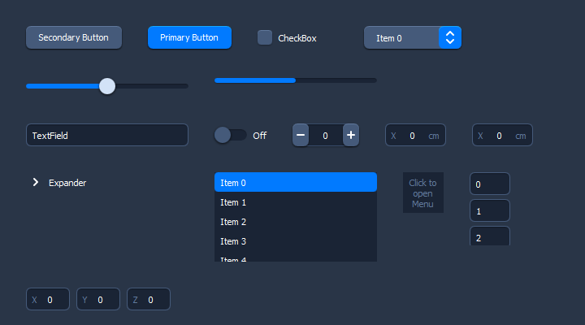

<p align="center" style="text-align:center">
	
	</br>
	</br>


</p>

# Luna



**Luna** is a QML components library (Buttons, CheckBoxes, SpinBoxes, etc.) aimed to desktop usage.

- Based on QtQuickControls 2.
- **Fixes various behaviors** for default QML components.
- Adds support for a much needed `DoubleSpinBox`, to handle doubles (the standard one handles only integers).
- Provides a `TreeView`.
- Provides a `Vector3dEditor` to handle `QVector3D` objects.
- Lots of **animations** and **graphical effects**.

These new components are not 100% pure QML: they're based on C++ classes for the backend and logic, for performance reasons.

**Compatibility:** tested on Windows and macOS.

**Table of Contents**

- [How to use](#how-to-use)
- [Modules](#modules)
	- [Containers](#containers)
	- [Controls](#controls)
	- [Utils](#utils)
- [Author](#author)
- [License](#license)

## How to use

1. Link with the `luna` library.

2. If you're statically linking, initialize the lib's resources:

	```c++
	#include <luna/ResourceInitialization.hpp>

	luna::initializeResources();
	```
3. Declare the library to the QML engine to be able to use it:

	```c++
	#include <luna/QmlEngineConfig.hpp>

	luna::registerQmlModule(engine);
	```

4. In QML files, import the library as needed, where `<Module>` is a QML `luna` module:

	```qml
	import Luna.<Module> 1.0 as <Module>
	```
	Modules are:
	- `Containers`
	- `Controls`
	- `Dialogs`
	- `MainWindow`
	- `Styles`
	- `Utils`

	For detaied information about modules, read the [dedicated section](#moudles) below.

## Modules

### Containers

- `Expander`: Allows to hide/show UI with a nice animation.
- `Panel`
- `ScrollView`: Improved ScrollView that will scroll automatically to the item that gets active focus.

### Controls

- `BusyIndicator`
- `Button`
- `CheckBox`
- `ComboBox`
- `DoubleSpinBox`: Input field, with drag up/down support, that accepts doubles.
- `IntegerSpinBox`: Input field, with drag up/down support, that accepts integers.
- `LayoutSpacer`: Same as QtWidgets's QSpacerItem.
- `ListView`
- `ListViewItem`
- `Menu`
- `MenuItem`
- `MenuSeparator`
- `ProgressBar`
- `ScrollBar`
- `Separator`
- `Slider`
- `SpinBox`: Default (integer) SpinBox with +/- buttons.
- `Switch`
- `Text`
- `TextField`
- `TreeView`
- `TreeViewArrow`
- `Vector3dEditor`: Composed of 3 DoubleSpinBox and uses a `QVector3D` as value.

### Utils

- `AnimationUtils`: Allows to start an animation on a property.
- `BindingUtils`: Allows to change a value without breaking existing bindings.
- `ButtonShape` : Generic shape for buttons.
- `EventLoopUtils`: Allows to schedule a task.
- `FocusBorder` : Animated keyboard focus indicator.
- `GeometryUtils`: Various computations of item sizes.
- `InputShape` : Generic shape for text input fields.
- `MenuUtils`: Utilities to handle menus in QML.
- `Platform`: Get current OS from QML.
- `QtObject2`: QtObject that allows nesting of other QtObjects.
- `ScrollUtils`: Utilities to handle ScrollView behaviors.
- `SvgIcon`: Same as SvgImage but allows to change the overlay color.
- `SvgImage`: An image that takes source from a SVG file and scales correctly.
- `Tooltip`: Animated tooltip.

## Author

Olivier Cléro | [email](mailto:oclero@pm.me) | [website](https://www.olivierclero.com)

## License

**Luna** is available under the MIT license. See the [LICENSE](LICENSE) file for more info.
